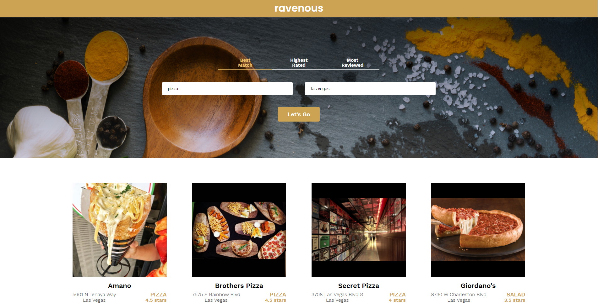
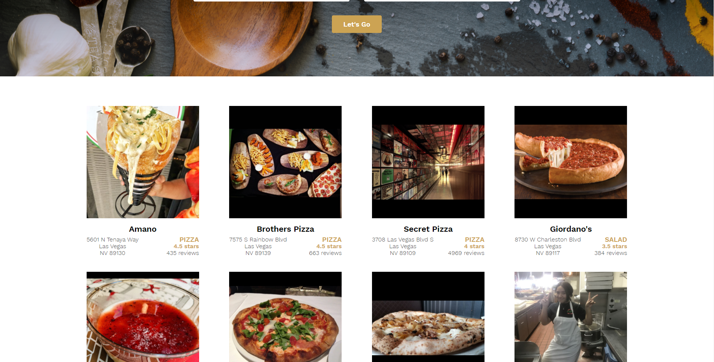
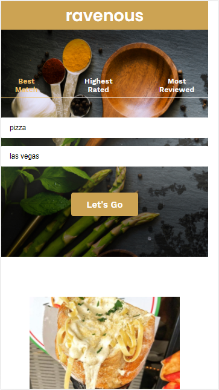
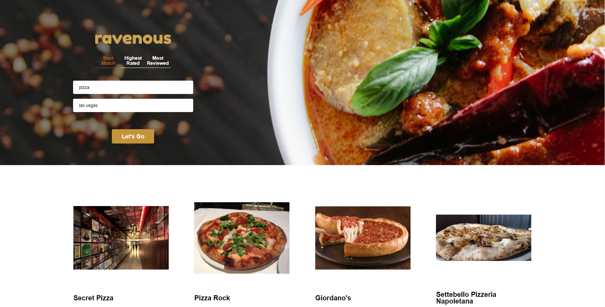
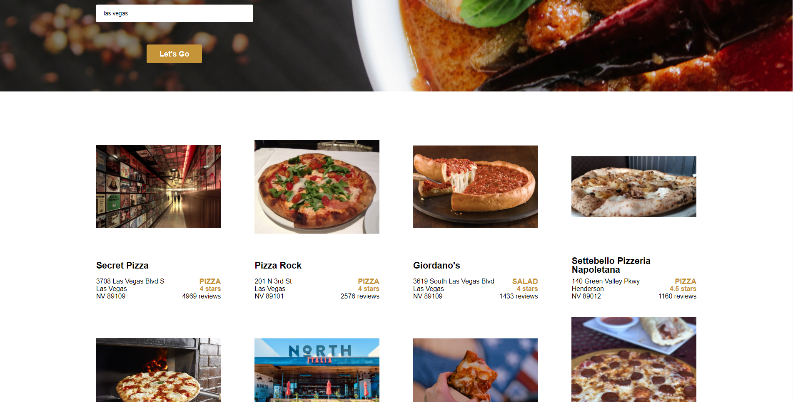
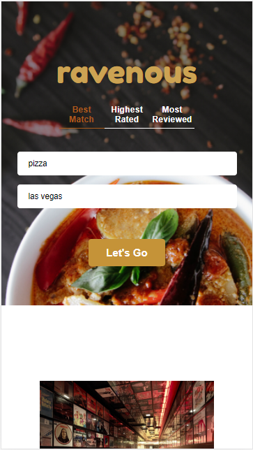

<h1>ravenous</h1>

This project was created as part of the Codecademy Web Development Career Path instruction.
The goal was to grate a front-end Application using React. The HTML (to be converted to JSX) and CSS was provided.
The application utilizes the Yelp API to return a list of restaraunts with the input specifications.

I made some changes to the styling to make the project my own, as well as added functionality to 
open a new window to google maps when clicking on business address.

<h2>Codecademy version:</h2> 

  

<h2>My version:</h2> 

  
This project was bootstrapped with [Create React App](https://github.com/facebook/create-react-app).
